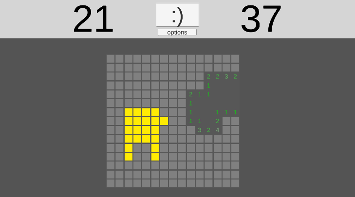
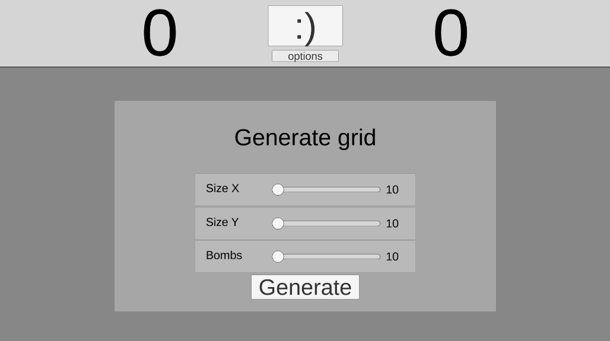

# MInesweeperExtended
simple minesweeper game made in unity in a few days

You can play it [here](https://simmer.io/@Heisenshark/minesweeper)

It got all the basic features at the moment and supports boards that contain up to 50*50 tiles  \
  
Player can generate a grid with up to 50X50 size and 100 bombs
also they can pan the camera and increase zoom to traverse larger maps  \

### Example gameplay
#### Controlls
- scroll to zoom
- drag scroll(or press Space) to pan
- left-click to reval tile (and reveal many if tile is already revealed)  
- right-click to flag a tile

  
  

### Premise

The game is pretty much quick prototype done in a few days(its too long anyway) acting as a showcase that I am familliar with unity in any way.

### Future
UI needs to be changed, the numbers should be of differrent colors or even size(imagine having daltonism)
The code responsible for tiles is pretty basic and good in prototype but it needs to be changed as I cant generate grid beyond 50x50 without stack-overflow.
I also want to add some spells for the player so they can exit out of tricky situations, fore example a skill revealing random  non-bomb tiles.
Also there is a dire need to refactor the code.
Maybe I will add some highscore option too.
